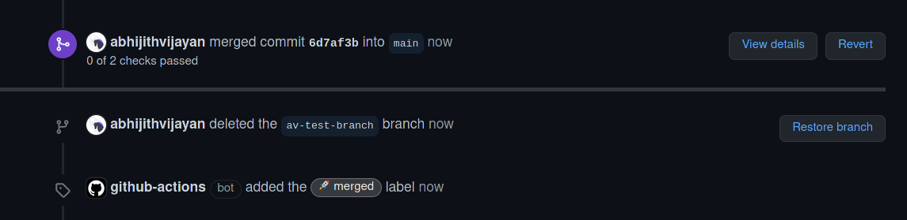

<h1 align="center">label-pr-on-merge-bot</h1>
<p align="center">GitHub Actions Bot to label specific pull requests with custom label on merge</p>
<div align="center">
  <a href="https://travis-ci.com/abhijithvijayan/label-pr-on-merge-bot">
    
  </a>
  </a>
  <a href="https://david-dm.org/abhijithvijayan/label-pr-on-merge-bot">
    
  </a>
  <a href="https://github.com/abhijithvijayan/label-pr-on-merge-bot/blob/main/license">
    
  </a>
  <a href="https://twitter.com/intent/tweet?text=Check%20out%20label-pr-on-merge-bot%21%20by%20%40_abhijithv%0A%0AGitHub%20Actions%20Bot%20to%20label%20pull%20requests%20with%20custom%20label%20on%20merge%0Ahttps%3A%2F%2Fgithub.com%2Fabhijithvijayan%2Flabel-pr-on-merge-bot%0A%0A%23node%20%23javascript%20%23github%20%23bot%20%23npm">
     
  </a>
</div>
<h3 align="center">🙋‍♂️ Made by <a href="https://twitter.com/_abhijithv">@abhijithvijayan</a></h3>
<p align="center">
  Donate:
  <a href="https://www.paypal.me/iamabhijithvijayan" target='_blank'><i><b>PayPal</b></i></a>,
  <a href="https://www.patreon.com/abhijithvijayan" target='_blank'><i><b>Patreon</b></i></a>
</p>
<p align="center">
  <a href='https://www.buymeacoffee.com/abhijithvijayan' target='_blank'>
    
  </a>
</p>
<hr />

Add a trigger label to the PR

Bot will add post merge label to the PR once it's merged


❤️ it? ⭐️ it on [GitHub](https://github.com/abhijithvijayan/label-pr-on-merge-bot/stargazers) or [Tweet](https://twitter.com/intent/tweet?text=Check%20out%20label-pr-on-merge-bot%21%20by%20%40_abhijithv%0A%0AGitHub%20Actions%20Bot%20to%20label%20pull%20requests%20with%20custom%20label%20on%20merge%0Ahttps%3A%2F%2Fgithub.com%2Fabhijithvijayan%2Flabel-pr-on-merge-bot%0A%0A%23node%20%23javascript%20%23github%20%23bot%20%23npm) about it.

## Table of Contents

- [Usage](#usage)
- [Issues](#issues)
  - [🐛 Bugs](#-bugs)
- [Publish](#publish)
- [LICENSE](#license)

## Usage

The bot is particularly useful when you want to trigger some CI(to deploy the branch) by adding label to the PR, only after it is merged.
This also helps if you want to avoid deployment costs with multiple deployments with every PR merge.

### Sample workflow
You can use PR Merge Bot by configuring a YAML-based workflow file, e.g. `.github/workflows/label-pr-on-merge-bot.yml`.

```yaml
name: Label PR on Merge Bot Action

on:
  pull_request:
    types: [ closed ]

jobs:
  label_pr_job:
    if: github.event.pull_request.merged == true
    runs-on: ubuntu-latest
    steps:
      - name: Label PR on Merge Bot
        uses: abhijithvijayan/label-pr-on-merge-bot@v1
        with:
          GITHUB_TOKEN: ${{ secrets.GITHUB_TOKEN }}
          label: 'bot: label on merge'
          post_merged_label: '🚀 merged'
```

## Issues

_Looking to contribute? Look for the [Good First Issue](https://github.com/abhijithvijayan/label-pr-on-merge-bot/issues?q=is%3Aissue+is%3Aopen+sort%3Aupdated-desc+label%3A%22good+first+issue%22)
label._

### 🐛 Bugs

Please file an issue [here](https://github.com/abhijithvijayan/label-pr-on-merge-bot/issues/new) for bugs, missing documentation, or unexpected behavior.

[**See Bugs**](https://github.com/abhijithvijayan/label-pr-on-merge-bot/issues?q=is%3Aissue+is%3Aopen+sort%3Aupdated-desc+label%3A%22type%3A+bug%22)

## Publish

Run [ncc](https://github.com/zeit/ncc) to build into single file and release a new version from `Releases` on GitHub:
```bash
yarn build
yarn package
```


### Linting & TypeScript Config

- Shared Eslint & Prettier Configuration - [`@abhijithvijayan/eslint-config`](https://www.npmjs.com/package/@abhijithvijayan/eslint-config)
- Shared TypeScript Configuration - [`@abhijithvijayan/tsconfig`](https://www.npmjs.com/package/@abhijithvijayan/tsconfig)

## License

MIT © [Abhijith Vijayan](https://abhijithvijayan.in)
